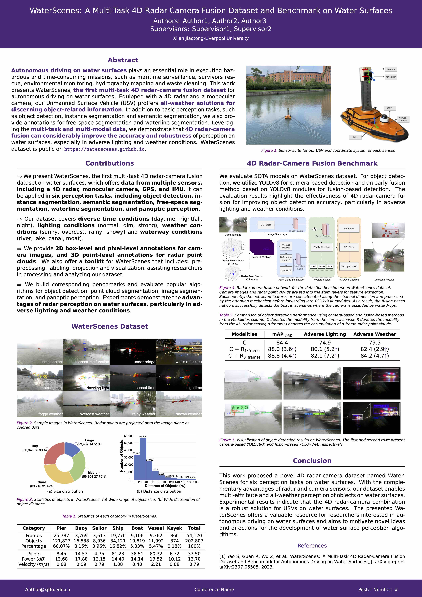

<!-- Title -->

    <h1><b>XJTLU Poster Template</b></h1>

<!-- Badges -->

<!-- Table of Contents -->

    <a href="#what is it?">What is it?</a> •
    <a href="#usage">Usage</a> •
    <a href="#example">Example</a>

<!-- Sections -->
## What is it?

This project aims to create a poster template for the Xi'an Jiaotong-Liverpool University (XJTLU). 

## Usage

Copy or download the project, and then modify the latex content.

- <b>Overleaf:</b> https://www.overleaf.com/latex/templates/XJTLU-Poster-template/jftxgnqrpxps
  
- <b>Github:</b> https://github.com/yaoshanliang/XJTLU-Poster-Template

## Example

    

